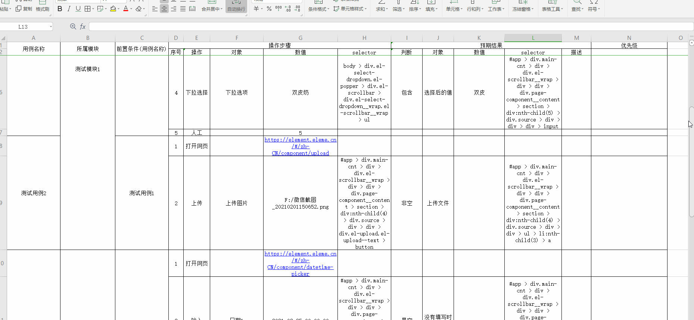
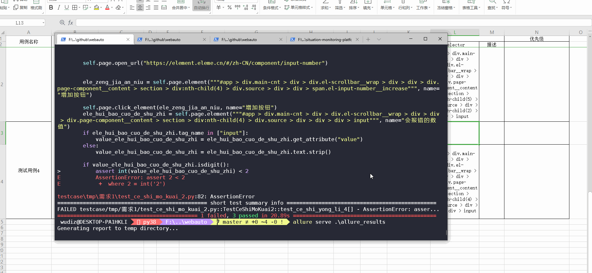

# GET STARTED
- 根据自己chrome的版本。下载chromedriver
- 安装java，并配置环境路径()
- 下载allure, 并加入环境路径(开发测试版本2.10.0)
- 安装python和依赖包(开发测试使用版本是Python 3.8.3)


# USAGE

## 1.编辑测试用例excel
参考[示例.xlsx](example/示例.xlsx)

复制example目录底下的[测试用例模板.xlsx](example/测试用例模板.xlsx)

编写自己的测试用例[详细方法](docs/how_to_write_excel.md)

## 2.生成代码

```bash
TCG.
自动化测试
Usage:
  cmdline.py <path> [-o FILE]
  cmdline.py (-h | --help)
  cmdline.py --version

Options:
  -h --help     Show this screen.
  --version     Show version.
  -o DIR --output DIR 输出路径.
```

```shell
python cmdline.py 测试用例.xlsx -o <输出目录>
```


## 3.执行测试生成报告
在命令行中切换到webautotest目录，执行
```shell
pytest --alluredir=.\allure_results --clean-alluredir -v
```


查看报告，执行
```shell
allure serve .\allure_results
```


生成html报告，执行
```shell
allure generate .\allure_results -o .\allure_html
```


# TODO
- [ ] 只有一行测试用例的bug, 只有一个op操作步骤的bug
- [x] 路径使用中文
- [ ] 更多的操作，~~日期选择，上传~~，拖拽等
- [ ] 支持使用输入的参数当作结果判断，例如 assert element.text.strip() == input_param
- [x] 支持判断结果是空或者不是空，大于小于等, 支持判断结果长度
- [x] ~~操作支持下拉选择(自定义前端框架的dropdown menu, 没有使用\<select\>)~~, 改用css-selector
- [ ] 执行顺序的优化
- [x] ~~driver地址加入命令行参数~~暂时使用通用名称
- [ ] 自动生成脑图
- [ ] 测试用例自动记录到禅道,tpad
- [ ] 测试结果自动添加到禅道记录bug
- [ ] 增加接口的自动化测试
