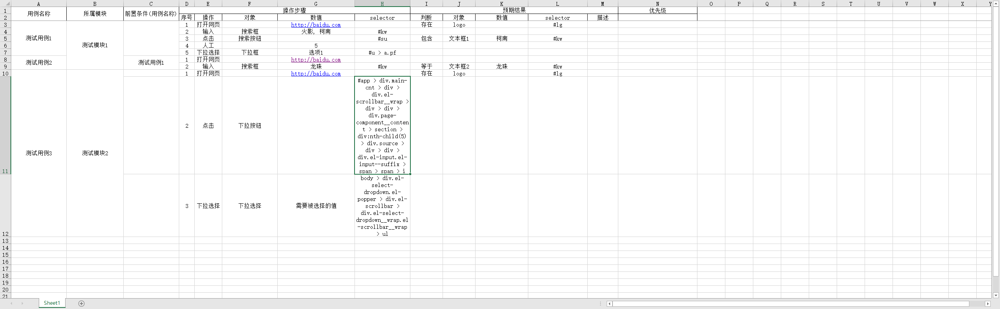
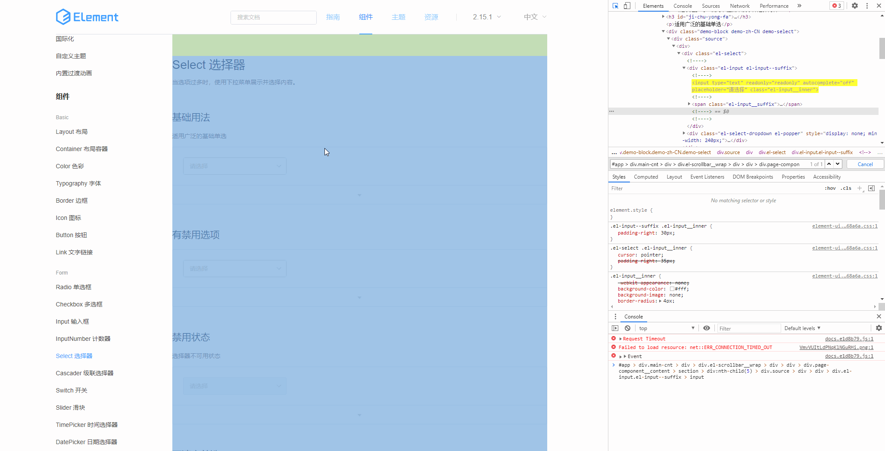
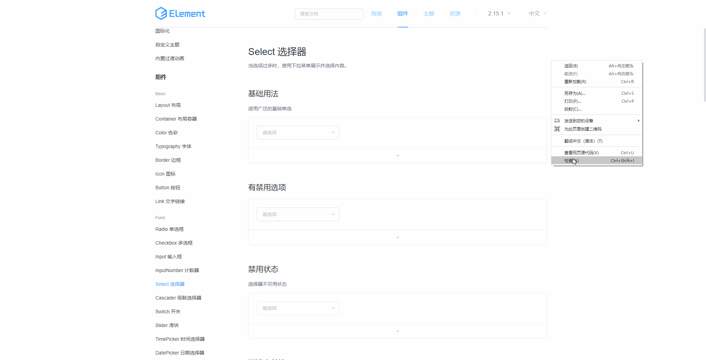

# 1.excel模板

# 2.操作类型

## 2.1 打开网页
浏览器打开相应url地址

## 2.2 输入
向对应的元素输入数值
多个值使用换行分割

## 2.3 点击
点击相应的元素

## 2.4 人工
浏览器等待人工操作几秒

## 2.5 下拉选择
下拉框选择相应的数值

## 2.6 上传
上传文件

# 3.判断类型

## 3.1 存在
相应元素存在

## 3.2 等于
相应元素的文字等于输入的值

## 3.3 包含
相应元素的文字包含输入的值

## 3.4 是空
相应元素的文字是空

## 3.5 非空
相应元素的文字不是空

## 3.6 大于
相应元素的文字如果是数字，则大于输入的值，如果不是数字，则字数大于输入的值

## 3.7 小于
相应元素的文字如果是数字，则小于输入的值，如果不是数字，则字数小于输入的值

# 常见问题

## 如何获取目标元素的selector值

